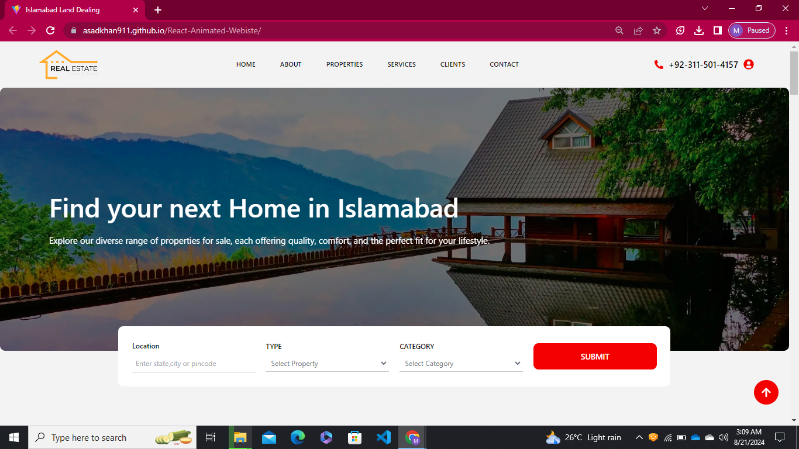
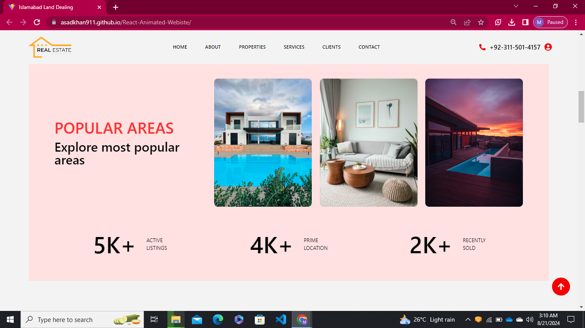
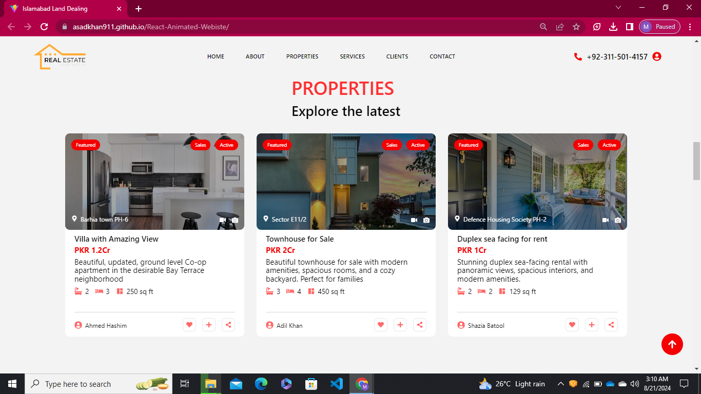
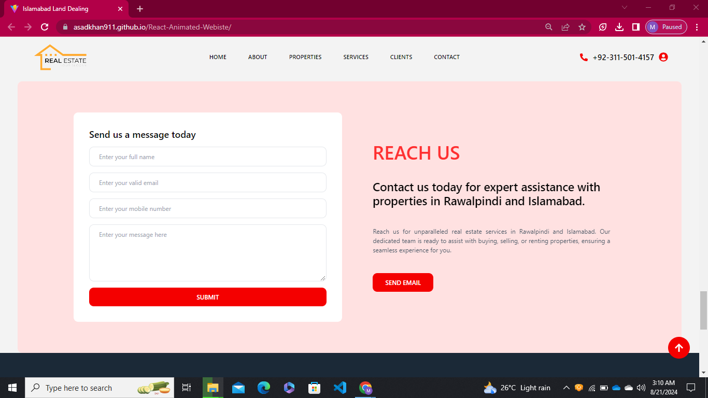
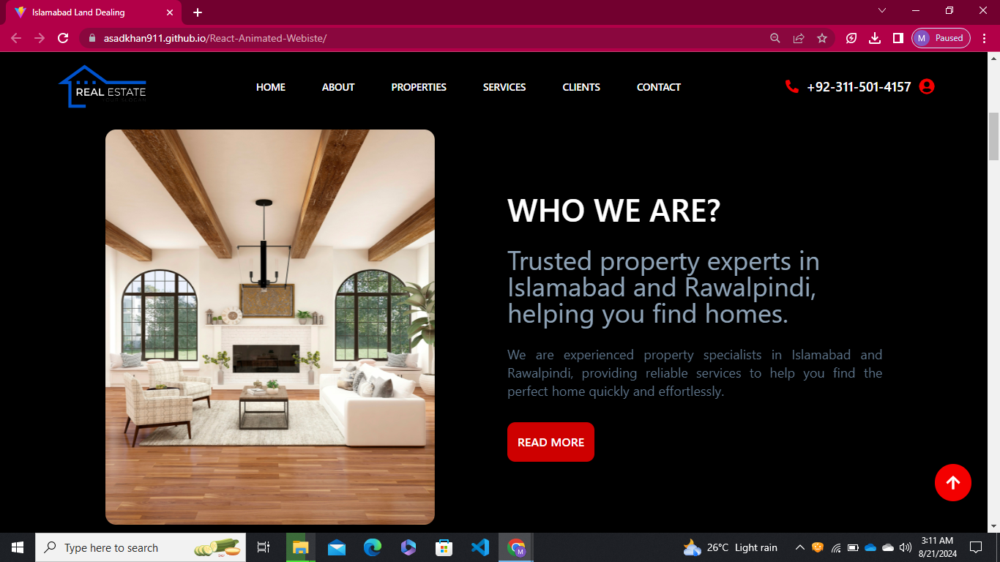

# Property Website

A fully responsive property website built with ReactJS, featuring a sleek dark mode with a draggable toggle, animations powered by Framer Motion, and a modern UI. The dark mode enhances the aesthetics, offering a beautiful browsing experience. ✨

## Demo

[View Live Demo](https://asadkhan911.github.io/React-Animated-Webiste/)

## Demo Pictures

<p align="center">
  
  
  
</p>

<p align="center">
  
  
  
</p>

## Features

- Dark mode with a draggable toggle
- Animations powered by Framer Motion
- Fully responsive design for all devices
- Modern and clean UI

## Installation

1. Clone the repo
   ```sh
   git clone https://github.com/your-username/property-website.git
